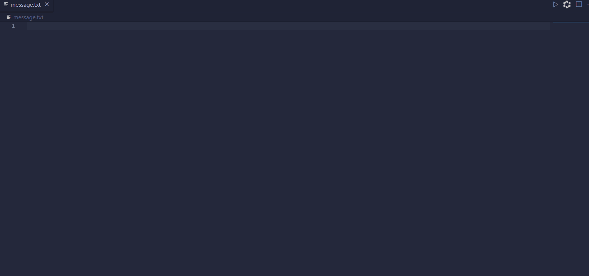

# Golang Flutter App FFI

This repo demonstrates a very simple `Flutter` app with `Golang` used as backend lanugage, communicating using `FFI (Foreign Function Interface)`,
the app is a very simple note taking app that currently allows you to whip up a message and save it into a `message.txt` file.

## Example



## Prerequisites

- `go`
- `make`
- `flutter sdk` version `2.16.2^`

## Usage

Try it out:

```bash
$ make run

# Overrite FLUTTER_DEVICE to change the flutter device build option
# WARNNING: may not work with certain devices
$ make run FLUTTER_DEVICE=chrome
```

## Tested Devices

The following are the [Flutter Supported Devices](https://docs.flutter.dev/development/tools/sdk/release-notes/supported-platforms#supported-platforms)  

### Mobile

- [ ] android
- [ ] ios

### Desktop

- [x] windows
- [ ] linux

## Project Structure

- lib
  - main.dart
  - create_message.dart
- vendor
  - text.go
  - go.mod
- vendor/out (tmp)
  - text.a
  - text.h

`lib` - flutter code files

`create_message.dart` - Golang logic using FFI to Dart

`vendor` - Golang files as backend

`vendor/out` - Golang compiled files

---

## add_lib
- **Android**
1. 编译libmessage.so `cd vendor && bash build.bash`
2. 创建libmessage.so在android的目录 `cp -ax libs/ ../android/app && cd ../android/app/`
3. 创建CMakeLists.txt `cat CMakeLists.txt`
4. 指定cmake版本 `cd ../ vim local.properties` `cmake.dir=/path/Android/Sdk/cmake/3.22.1`
5. build

flutter build apk --obfuscate --split-debug-info=build --release

## License

[MIT](LICENSE).
